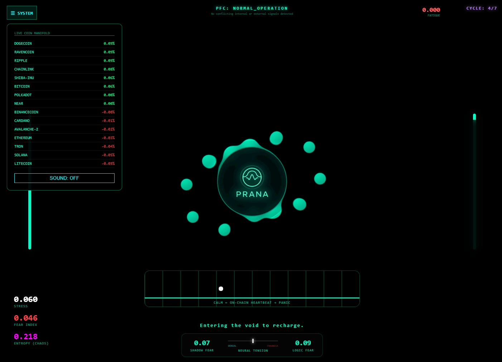

# PRANA: Relativistic Neural Engine v12.9

Add monitor preview and UI template

PRANA is an advanced market analysis core utilizing bio-digital metaphors to process on-chain data.

## Key Innovations

*Neural Tensor\*\*: Dynamic dopamine/adrenaline evolution based on market surprise.

*On-chain Cardiogram\*\*: High-sensitivity volatility expander for micro-movement detection.

*Shadow Core\*\*: Monte Carlo simulation of panic probabilities.

**Shadow Core v2.5 (`evolution_pro.py`):** Powered by **Monte Carlo Behavioral Simulation (MCBS)**. It runs 100 parallel simulations per cycle to detect "Crowd Hysteria" and "Mass Denial" before they manifest in price action.

